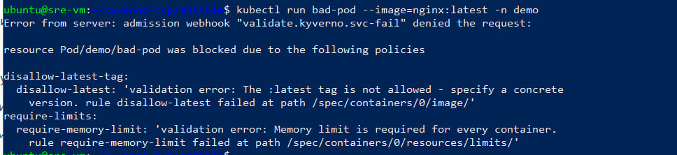
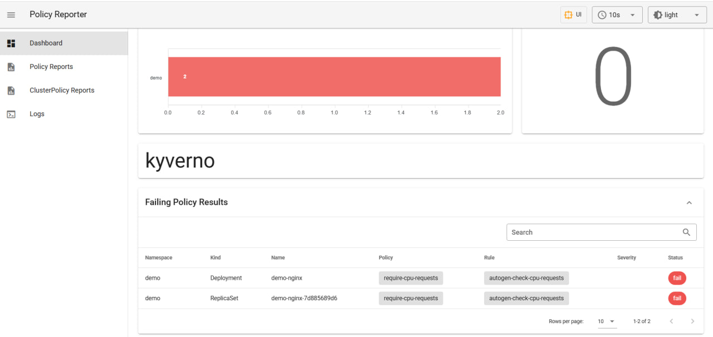
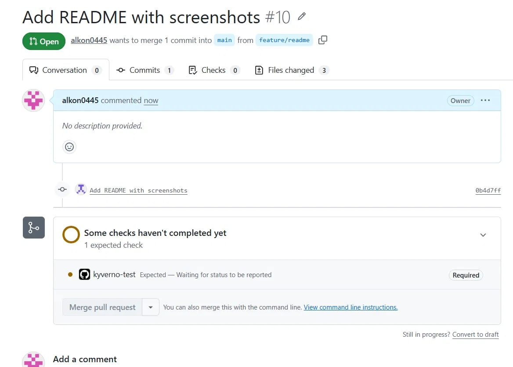

# Kyverno MVP

Демо-стенд [Kyverno](https://kyverno.io/): политики безопасности для Kubernetes хранятся в Git, тестируются в CI, доставляются в кластер через ArgoCD. Попытка задеплоить манифест, нарушающий политику, отклоняется на этапе admission. Состояние безопасности видно на дашборде Policy Reporter.

Стенд разворачивается на чистую ВМ одной командой Ansible.

## Состав

- **KinD** — кластер `sre-lab` на одной ноде, порты 80/443 проброшены на хост
- **ArgoCD** — App of Apps: корневое приложение подтягивает из репозитория все остальные
- **ingress-nginx** — вход в сервисы по доменным именам
- **kube-prometheus-stack** — Prometheus и Grafana в урезанной конфигурации (см. допущения)
- **Kyverno** — 4 политики: три Enforce, одна Audit
- **Policy Reporter** — дашборд по отчётам Kyverno
- **demo** — nginx, на котором удобно проверять политики

## Архитектура

```
Локальный ПК ──ansible-playbook──► ВМ
                                    │
                                    ├─ Docker + KinD (кластер sre-lab)
                                    ├─ ArgoCD ◄──── этот репозиторий (main)
                                    │     │
                                    │     └─ root ─► apps/
                                    │           ├─ demo
                                    │           ├─ ingress-nginx
                                    │           ├─ monitoring
                                    │           ├─ kyverno
                                    │           ├─ policies
                                    │           ├─ policy-reporter
                                    │           └─ argocd-config
                                    │
                                    └─ Kyverno: admission-контроль,
                                       плохие манифесты не доходят до кластера
```

Папка `apps/` оформлена как Helm-чарт: адрес репозитория задаётся одной переменной, поэтому стенд работает из любого форка без правки файлов.

## Требования

Локально: Ansible, git, SSH-доступ к ВМ.

ВМ: Ubuntu/Debian, 8 ГБ RAM, доступ в интернет. Ожидается пользователь `ubuntu` с sudo — если у вас другой, поправьте `ansible_user` в inventory и пути `/home/ubuntu` в плейбуке.

Docker, kubectl, KinD и сам кластер ставит плейбук.

## Запуск

1. Форкните репозиторий. ArgoCD тянет манифесты из Git автоматически, поэтому ему нужен репозиторий, в который вы сможете пушить.

2. На локальном ПК добавьте в `/etc/hosts` строку с IP вашей ВМ:

   ```
   <IP-ВМ> demo.local grafana.local argocd.local policyreporter.local
   ```

3. В `ansible/inventory.ini` укажите IP ВМ:

   ```ini
   [stand]
   sre-vm ansible_host=<IP-ВМ> ansible_user=ubuntu
   ```

4. Из папки `ansible/`:

   ```bash
   ansible-playbook playbook.yml -i inventory.ini \
     -e repo_url=https://github.com/<ВАШ_ЛОГИН>/kyverno-mvp \
     -e grafana_admin_password=<ПАРОЛЬ>
   ```

   `repo_url` — адрес вашего форка, `grafana_admin_password` — пароль администратора Grafana. Оба передаются при запуске, в коде не хранятся.

5. Плейбук отрабатывает за несколько минут. Дальше ArgoCD сам разворачивает приложения — на скачивание образов уходит ещё 10–20 минут. Следить можно так:

   ```bash
   kubectl get applications -n argocd        # ждём Synced / Healthy у всех
   kubectl get pods -A | grep -v Running     # список неготовых должен растаять
   ```

Повторный запуск плейбука безопасен: он идемпотентен и просто доводит систему до нужного состояния.

## Доступы

| Сервис | URL | Логин | Пароль |
|---|---|---|---|
| ArgoCD | http://argocd.local | admin | см. ниже |
| Grafana | http://grafana.local | admin | из `-e grafana_admin_password` |
| Policy Reporter | http://policyreporter.local | — | — |
| demo | http://demo.local | — | — |

Пароль ArgoCD генерируется при установке:

```bash
kubectl get secret argocd-initial-admin-secret -n argocd \
  -o jsonpath='{.data.password}' | base64 -d && echo
```

## Проверка Kyverno

Попробуйте создать под с образом без фиксированной версии:

```bash
kubectl run bad-pod --image=nginx:latest -n demo
```

Под не создастся:

```
Error from server: admission webhook "validate.kyverno.svc-fail" denied the request:

resource Pod/demo/bad-pod was blocked due to the following policies

disallow-latest-tag:
  disallow-latest: 'validation error: The :latest tag is not allowed - specify a concrete version. ...'
require-limits:
  require-memory-limit: 'validation error: Memory limit is required for every container. ...'
```



Здесь сработали сразу две политики. Деплой нарушающего манифеста через Git закончится так же — отказ получит ArgoCD при синхронизации.

На http://policyreporter.local — результаты всех проверок по namespace. Политика `require-cpu-requests` работает в Audit и намеренно «ловит» demo (у него нет CPU requests), поэтому на дашборде есть и fail, а не только зелёные отметки.



Метрики Kyverno и Policy Reporter собирает Prometheus, смотреть можно в Grafana.

## Политики

| Политика | Режим | Проверка |
|---|---|---|
| disallow-latest-tag | Enforce | у образа есть тег, и это не `:latest` |
| require-limits | Enforce | у контейнера задан memory limit |
| disallow-privileged | Enforce | privileged запрещён |
| require-cpu-requests | Audit | у контейнера задан CPU request |

Системные namespace (kube-system, argocd, kyverno, monitoring и т.д.) исключены из проверок — иначе политики блокировали бы рестарты самой инфраструктуры.

## Тесты и CI

Для каждой политики в `tests/` лежат тестовые манифесты и файл ожиданий. Запуск локально:

```bash
kyverno test tests/
```

Те же тесты гоняет GitHub Actions на каждый push и PR. Ветка `main` защищена: прямой push запрещён, PR не мёржится без зелёного `kyverno-test`. Непротестированная политика не попадает в main — а значит, и в кластер, потому что ArgoCD синхронизирует main.



## Допущения и решения

- **ingress-nginx, а не Envoy.** Для MVP взят самый предсказуемый вариант. Ingress-контроллер — отдельное приложение ArgoCD, так что замена не потребует перестраивать стенд.
- **Monitoring урезан:** Alertmanager выключен, retention Prometheus 24 часа, лимит памяти 1 ГБ. Иначе в 8 ГБ ВМ тесно.
- **Политики написаны для Pod.** Правила для Deployment и других контроллеров Kyverno генерирует сам (autogen).
- **Одна политика в Audit** — так Kyverno обычно и внедряют: сначала статистика, потом Enforce.
- **Server-side apply** для ArgoCD и тяжёлых чартов: их CRD не влезают в лимит аннотации client-side apply. В плейбуке добавлен `--force-conflicts`, чтобы прогон работал и поверх существующей установки.
- **Обязательное ревью в branch protection отключено:** свой PR одобрить нельзя, а второго человека в проекте нет. Обязательный PR и зелёный CI включены.
- **Секретов в репозитории нет.** Пароль Grafana передаётся при запуске плейбука и не пишется в логи (`no_log`), пароль ArgoCD остаётся сгенерированным.
- **ArgoCD за ingress в insecure-режиме,** TLS в стенде не настроен — упрощение демо.

## Структура репозитория

```
ansible/                # развёртывание
  playbook.yml          # Docker → KinD → ArgoCD → секрет → root-app
  inventory.ini         # IP вашей ВМ
  files/
    kind-config.yaml    # порты 80/443, метка для ingress
    root-app.yaml.j2    # шаблон корневого приложения
apps/                   # Helm-чарт из Application-манифестов (App of Apps)
manifests/              # демо-приложение, ingress для ArgoCD
policies/               # ClusterPolicy Kyverno
tests/                  # тесты для kyverno test
.github/workflows/      # CI
```

## Если что-то не работает

- Приложения висят в Progressing — скорее всего, качаются образы. Дайте стенду 10–20 минут.
- 404 от nginx в браузере — ingress жив, но не нашёл правило для домена. Проверьте hosts и написание домена.
- 503 — правило есть, сервис за ним ещё не поднялся. Смотрите поды в соответствующем namespace.
- ArgoCD не видит свежий коммит — он опрашивает Git раз в ~3 минуты. Можно нажать Refresh у приложения root.
- Плейбук упал на скачивании — сетевой сбой; скачивания повторяются до 3 раз, повторный запуск плейбука безопасен.
